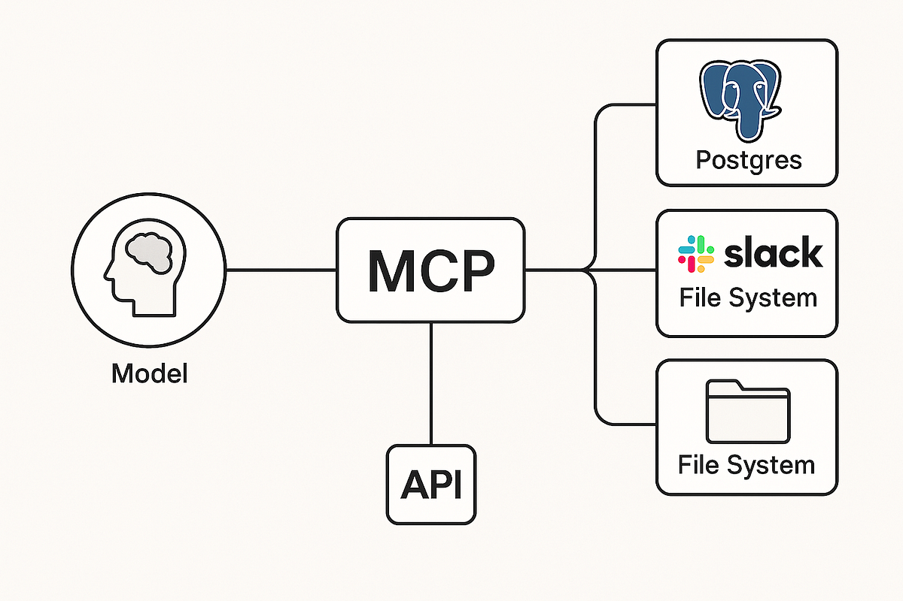
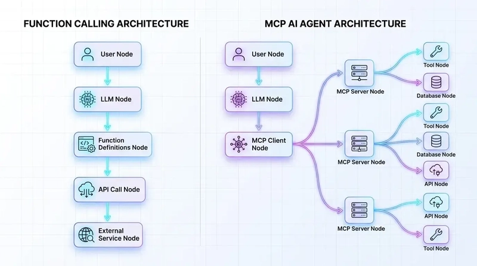

# Model Context Protocol (MCP)

## The USB-C for AI: A Beginner's Guide (2026)

**What is MCP?**

The **Model Context Protocol (MCP)** is an open standard introduced by Anthropic in November 2024 that lets AI applications securely and consistently connect to external data sources, tools, and services.

Think of MCP like **USB-C for AI apps**.

Just like USB-C lets any device plug into chargers, displays, or storage using one standard connector, MCP lets any MCP-compatible AI client (Claude, VS Code, Cursor, etc.) plug into any MCP server that exposes useful capabilities.

---

## The Problem MCP Solves

Before MCP, connecting an AI to your data or tools meant writing lots of custom "glue code" for every integration:

- Custom authentication handling
- One-off API wrappers
- Data transformation logic
- Tool schema definitions repeated for every new source

Even with great frameworks like LangChain, LlamaIndex, or CrewAI, each new data source (Google Drive, Slack, a database, local files, GitHub, Figma...) required bespoke engineering work.

**MCP changes this** by providing a universal protocol. Build an MCP server once, and it works with every MCP-aware AI client.

---

## The Images That Explain MCP

Here are four excellent diagrams that illustrate the concepts:

### 1. Overview of MCP

### 2. Architecture & Core Flow

### 3. Real-World Use Case / Example

### 4. How MCP Connects Models to Context

---

## How MCP Works

MCP uses a clean **client-server** architecture:

- **MCP Hosts** — The AI applications themselves (Claude Desktop, IDE extensions, custom agents).
- **MCP Clients** — Live inside the host. They discover and talk to servers using the protocol.
- **MCP Servers** — Lightweight programs you (or others) run that expose three main things:
  1. **Tools** — Actions the AI can take (e.g. "create issue", "query database", "send message").
  2. **Resources** — Readable context/data (files, docs, database records, API responses).
  3. **Prompts** — Reusable prompt templates the AI can discover and use.

Communication happens over stdio (local) or HTTP/SSE (remote), with clear JSON-RPC style messages.

The AI model doesn't hardcode anything — it dynamically discovers what tools/resources/prompts are available from the connected servers and uses them when appropriate.

---

## Why This Matters

- **Write once, integrate everywhere** — One MCP server for your company's internal tools works in Claude, your IDE, and future AI apps.
- **Better security & sandboxing** — Servers run separately from the model host. You control permissions and data exposure.
- **Discoverability** — No more manually writing JSON schemas for every tool. Servers describe their own capabilities.
- **Ecosystem growth** — Many official and community MCP servers already exist (GitHub, Google Drive, Slack, Postgres, filesystem, browser automation, etc.).
- **Adoption** — Supported by Anthropic's Claude, OpenAI clients, VS Code, Cursor, and many developer tools.

---

## Before vs After MCP

| Aspect                    | Pre-MCP                                      | With MCP                                      |
|---------------------------|----------------------------------------------|-----------------------------------------------|
| Integration effort        | Custom code per tool / data source           | Build once (MCP server), works everywhere     |
| Tool definitions          | Manually written per client                  | Server declares them dynamically              |
| Auth & secrets            | Handled ad-hoc in every integration          | Centralized in the MCP server you control     |
| Context sources           | Limited or hardcoded                         | Dynamic & discoverable (files, DBs, APIs)     |
| Portability               | Tied to specific framework or client         | Universal across MCP clients                  |

---

## Quick Start Concepts

To get value from MCP you typically:

1. Use an **MCP client** (e.g. Claude Desktop or an IDE with MCP support).
2. Connect one or more **MCP servers**.
3. The AI can now see and use the exposed tools/resources/prompts.

Developers can build their own MCP servers in any language (official SDKs exist for TypeScript, Python, etc.). A server can be as simple as a few dozen lines that list tools and handle calls.

Many pre-built servers are available on GitHub and via package registries.

---

## Key Resources

- Official site: [modelcontextprotocol.io](https://modelcontextprotocol.io)
- Anthropic announcement: [Introducing the Model Context Protocol](https://www.anthropic.com/news/model-context-protocol)
- Great for developers wanting to expose internal company data or custom tools to frontier models without reinventing the integration layer each time.

---

## Summary

MCP is the emerging universal standard for giving AI models rich, live, actionable context from the real world.

The diagrams above show the shift from fragmented custom integrations to clean, reusable, discoverable servers.

If you're building AI-powered apps or agents in 2026, understanding and using MCP is quickly becoming essential.

---

*This guide incorporates illustrative diagrams originally shared in community articles on Medium and dev.to. The goal is to provide a clear, self-contained explanation inside your mcp-guide repository.*